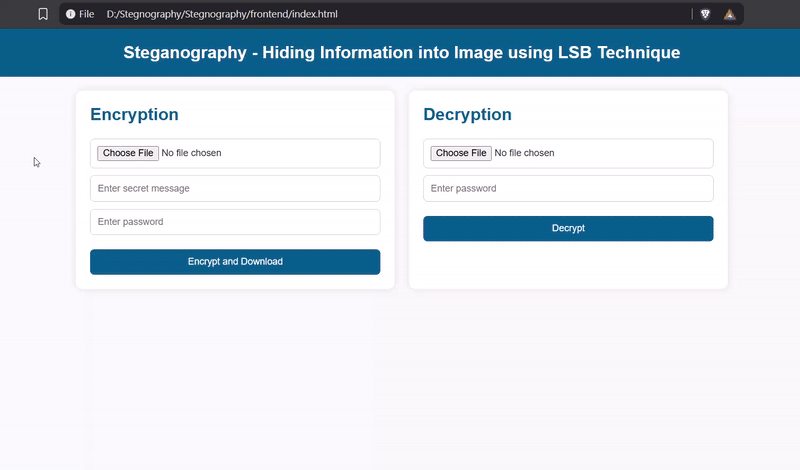

# Steganography – Hiding Secret information Into Images using LSB (Least Significant Bit) Method

A web application to hide and reveal secret messages inside images using the Least Significant Bit (LSB) steganography technique. Built with Python (Flask) on the backend and HTML/CSS/JavaScript on the frontend.

##  Project Overview

This project allows users to:
- Hide a secret text message inside an image using LSB.
- Secure it with a password.
- Download the encrypted image.
- Upload the encrypted image later and extract the hidden message using the correct password.

##  Preview / Demo

## 📽️ Project Preview



##  Tech Stack

**Frontend:** HTML5, CSS3, JavaScript  
**Backend:** Python (Flask)  
**Libraries:** OpenCV, Flask-CORS, NumPy

##  Folder Structure

```
steganography-web-app/
│
├── backend/
│   ├── main.py          
│   ├── encrypt.py       
│   ├── decrypt.py       
│
├── frontend/
│   ├── index.html       
│   ├── style.css        
│   └── script.js       
│
├── static/
│   └── uploaded/        # Temporarily stores uploaded images
│
├── requirements.txt     
└── README.md            
```

##  How to Run the Project Locally

### Backend (Python Flask)
---
```
# Clone the repo
    git clone https://github.com/darshanbagade/Stegnography.git
    cd Stegnography

# Create virtual environment (optional)
    python -m venv venv
    venv\Scripts\activate      # On Windows
    # source venv/bin/activate  # On macOS/Linux

# Install dependencies
    pip install -r requirements.txt

# Run Flask server
    python main.py
```

>Flask will start on: http://127.0.0.1:5000


### Frontend (Static HTML)
---
```
# In a new terminal 
    cd steganography-web-app/frontend
    python -m http.server 8000
```

>Frontend will start on: http://localhost:8000  
>Make sure the backend server is also running.

##  How to use
- **Encrypt a Message**

1. Upload a clean image.
2. Enter the secret message and a password.
3. Click "Encrypt and Download" – the image with hidden text will be downloaded.

- **Decrypt a Message**

1. Upload the encrypted image.
2. Enter the correct password.
3. Click "Decrypt" – the message will be revealed if the password matches.


